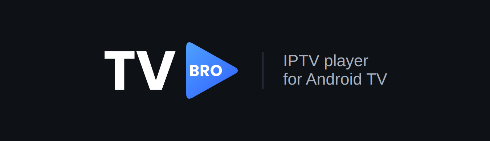

  

  <b>English</b> · <a href="#русский">Русский</a>

  <a href="https://github.com/it-with-bro/TV-BRO/releases/latest">⬇ Download the latest APK</a>

---

# TV BRO — IPTV player for Android TV

TV BRO is a simple, fast IPTV player built for TV boxes and Android TV, fully controlled with a remote.
You add your own playlist (m3u/m3u8) and TV guide (XMLTV) — the app shows channels, what's on now,
the programme schedule and lets you watch catch-up (archive) recordings if your provider offers them.

> [!IMPORTANT]
> **TV BRO is only a player.** It does not provide, sell or include any channels, streams, playlists or
> subscriptions. You need your own playlist from an IPTV provider you are legally subscribed to.
> The developers are not responsible for the content that users play with the app.

## Features

- **Made for the remote** — every screen works with arrows, OK and Back; no touchscreen needed.
- **Channel grid** with logos, what's on now and a progress bar; categories and channel order as in your playlist.
- **Favorites** — press ♥ in the player controls; the “Favorites” category comes first, and ▲▼ switch between favorite channels.
- **TV guide (EPG)** — XMLTV (`xml`, `xml.gz`, `zip`), or the `url-tvg` link from the playlist.
- **Archive (catch-up)** — watch past programmes, start the current one from the beginning, pause live TV, seek with a slider.
- **Search** across programme titles and descriptions on all channels; results open right at the right moment of the archive.
- **Setup from phone** — scan a QR code on the TV and paste links on your phone instead of typing them with the remote.
- **Auto update** of the playlist and TV guide every 6, 12 or 24 hours.
- **App updates** right from Settings (from this repository's releases).
- **Interface in English and Russian.**
- Stable playback: HLS and MPEG-TS (Media3 ExoPlayer), automatic reconnect after network drops, clear error messages.

## Requirements

- Android TV / Google TV box or TV, Android **7.0** or newer (also runs on phones and tablets).
- Your own IPTV playlist (m3u/m3u8). A TV guide link is optional.

## Installation

1. Download the latest `.apk` from [Releases](https://github.com/it-with-bro/TV-BRO/releases/latest).
2. Copy it to your TV box (USB drive, file manager, “Send files to TV”, etc.) and open it.
3. If asked, allow installing apps from unknown sources for the app you use to open the file.
4. Launch **TV BRO**, choose the language and add your playlist — with the remote or from your phone via QR code.

Later updates can be installed from **Settings → App update → Check for updates**.

## Remote control in the player

| Button | Action |
|---|---|
| OK | player controls: pause, from start, channels, TV guide, ♥ favorite |
| ▲ ▼ / CH+ CH− | previous / next channel |
| ◀ (live) | channel list over the video |
| ▶ (live), Menu, Guide | TV guide and archive of the channel |
| ◀ ▶ (archive) | seek slider: press ±60 s, hold to seek faster |
| Back | hide panel · return from archive to live · exit the player |

## Privacy

TV BRO has no accounts, ads or analytics and does not send your data anywhere. Playlist and TV guide
links are stored only on the device. The “Setup from phone” page works only in your local network,
is protected by a one-time code from the QR code and turns off automatically after use.

---

  <a href="#tv-bro--iptv-player-for-android-tv">English</a> · <b>Русский</b>

# TV BRO — IPTV-плеер для Android TV

TV BRO — простой и быстрый IPTV-плеер для ТВ-приставок и Android TV с полным управлением с пульта.
Вы добавляете свой плейлист (m3u/m3u8) и программу передач (XMLTV) — приложение показывает каналы,
что идёт сейчас, расписание и позволяет смотреть архив передач, если его поддерживает ваш провайдер.

> [!IMPORTANT]
> **TV BRO — это только проигрыватель.** Приложение не предоставляет, не продаёт и не содержит каналов,
> трансляций, плейлистов или подписок. Нужен собственный плейлист от IPTV-провайдера, услугами которого
> вы пользуетесь законно. Разработчики не несут ответственности за контент, который пользователи
> воспроизводят в приложении.

## Возможности

- **Создан для пульта** — все экраны управляются стрелками, OK и «Назад», сенсорный экран не нужен.
- **Сетка каналов** с логотипами, текущей передачей и полосой прогресса; категории и порядок каналов — как в плейлисте.
- **Избранное** — ♥ в панели управления плеера; раздел «Избранное» идёт первым, ▲▼ переключают избранные каналы.
- **Программа передач (EPG)** — XMLTV (`xml`, `xml.gz`, `zip`) или ссылка `url-tvg` из плейлиста.
- **Архив** — просмотр прошедших передач, текущая передача «с начала», пауза прямого эфира, перемотка ползунком.
- **Поиск** по названиям и описаниям передач всех каналов; результат открывается сразу в нужный момент архива.
- **Настройка с телефона** — отсканируйте QR-код на экране ТВ и вставьте ссылки на телефоне, а не вводите их пультом.
- **Автообновление** плейлиста и программы каждые 6, 12 или 24 часа.
- **Обновление приложения** прямо из настроек (из релизов этого репозитория).
- **Интерфейс на русском и английском.**
- Стабильное воспроизведение: HLS и MPEG-TS (Media3 ExoPlayer), автоматическое переподключение при обрывах сети, понятные сообщения об ошибках.

## Требования

- ТВ-приставка или телевизор с Android TV / Google TV, Android **7.0** и новее (работает и на телефонах, планшетах).
- Свой IPTV-плейлист (m3u/m3u8). Ссылка на программу передач — по желанию.

## Установка

1. Скачайте последний `.apk` в разделе [Releases](https://github.com/it-with-bro/TV-BRO/releases/latest).
2. Перенесите файл на приставку (флешка, файловый менеджер, «Send files to TV» и т.п.) и откройте его.
3. Если система попросит, разрешите установку приложений из неизвестных источников для программы, которой открываете файл.
4. Запустите **TV BRO**, выберите язык и добавьте плейлист — пультом или с телефона по QR-коду.

Следующие версии можно ставить из **Настройки → Обновление приложения → Проверить обновления**.

## Управление пультом в плеере

| Кнопка | Действие |
|---|---|
| OK | панель управления: пауза, с начала, каналы, программа, ♥ избранное |
| ▲ ▼ / CH+ CH− | предыдущий / следующий канал |
| ◀ (в эфире) | список каналов поверх видео |
| ▶ (в эфире), Menu, Guide | программа передач и архив канала |
| ◀ ▶ (в архиве) | ползунок перемотки: нажатие ±60 с, удержание — быстрее |
| Назад | скрыть панель · из архива — в прямой эфир · выйти из плеера |

## Конфиденциальность

В TV BRO нет аккаунтов, рекламы и аналитики, приложение никуда не отправляет ваши данные. Ссылки на
плейлист и программу хранятся только на устройстве. Страница «Настройка с телефона» работает только
в вашей домашней сети, защищена одноразовым кодом из QR-кода и выключается сама после использования.
